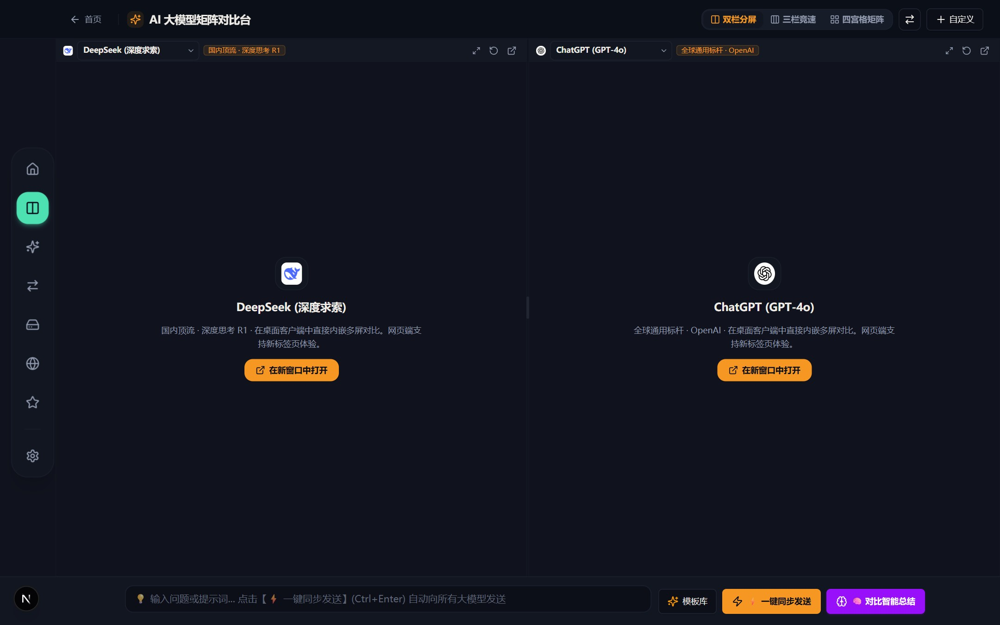
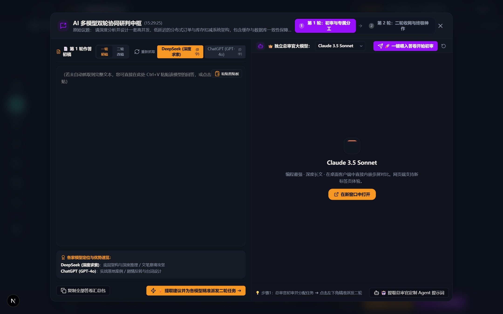
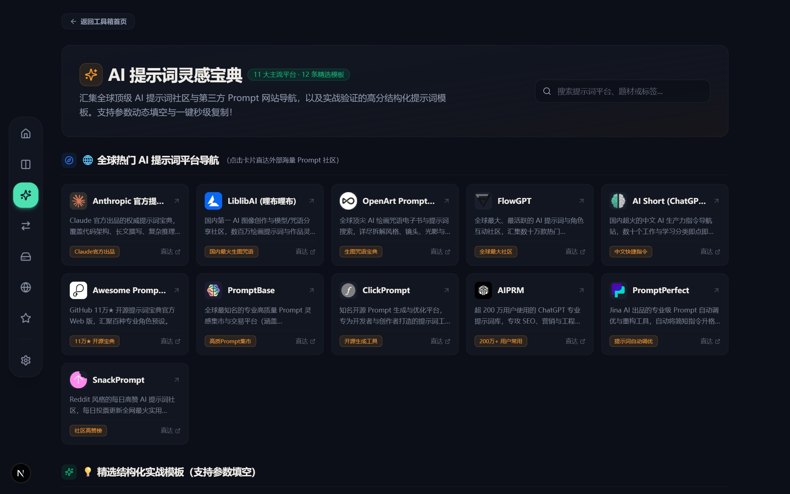
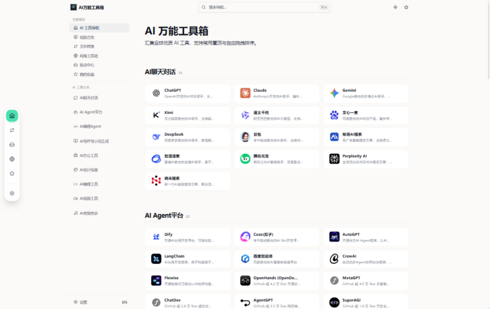
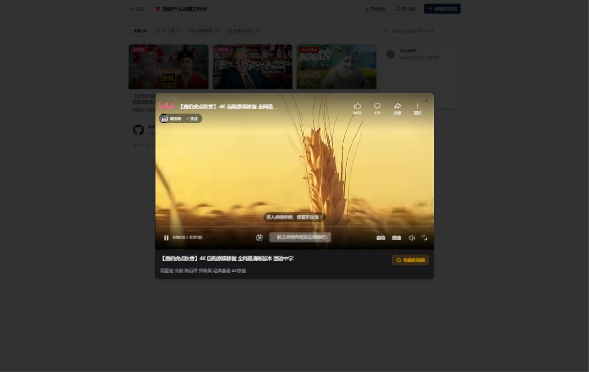
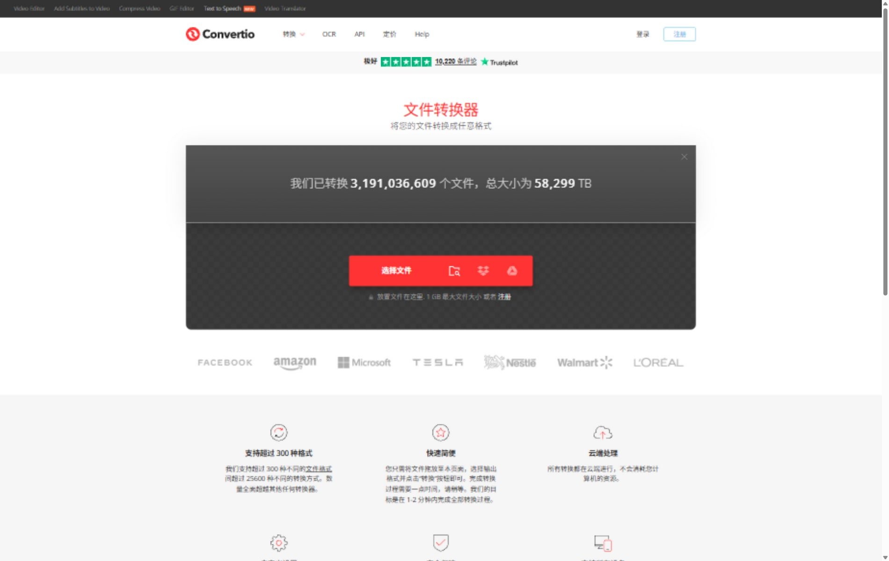
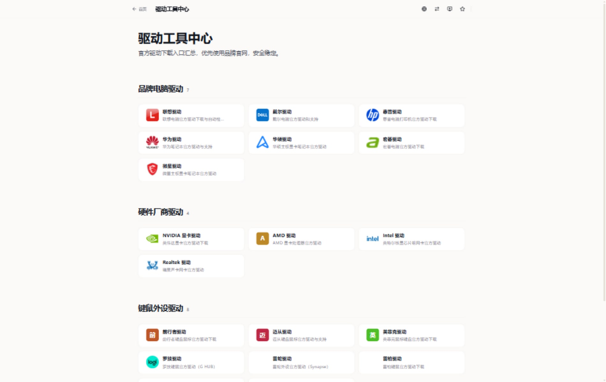
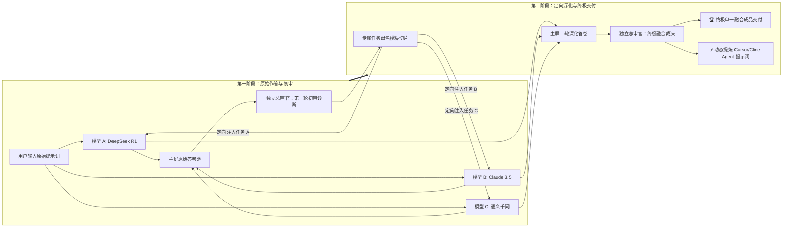

<div align="center">

# 🧰 AI万能工具箱 (AI Toolbox)

**面向未来的 AI 时代超级协同工作台与综合工具箱**
多大模型同台打擂 · 独立总审官协同 · 灵感宝典 · 视频收藏直看 · 300+ 格式转换 · 官方驱动网络

[](https://github.com/khssdsg-maker/ai-toolbox/releases)
[-green.svg?style=flat-square)](https://github.com/khssdsg-maker/ai-toolbox/releases/latest)
[](https://nextjs.org/)
[](LICENSE)

[🌐 官网宣传主页](https://khssdsg-maker.github.io/ai-toolbox/) · [🚀 在线极速体验版](https://ai-toolbox-ajc.pages.dev) · [⬇ 下载 Windows 最新安装包](https://github.com/khssdsg-maker/ai-toolbox/releases/latest) · [💬 提交反馈与建议](https://github.com/khssdsg-maker/ai-toolbox/issues)

</div>

---

## ⬇️ 快速下载安装（Windows 桌面端）

| 安装方式 | 详细说明 |
|---|---|
| **一键下载最新版** | [点击此处下载 Windows 安装包](https://github.com/khssdsg-maker/ai-toolbox/releases/latest)（支持 Win10 / Win11 64 位系统） |
| **极速安装流程** | 下载后双击 `.exe` 运行 → 选择安装目录 → 完成后桌面生成「AI万能工具箱」专属图标，即点即用 |
| **无感平滑升级** | 后续发布新版本直接覆盖安装，您的**所有收藏视频、自定义模型与个性化设置 100% 自动保留** |

---

## 🪟 核心功能拟真视窗画廊 (Visual Window Gallery)

<table>
  <tr>
    <td width="50%" align="center" valign="top">
      <h3>⚔️ 视窗 ①：AI 大模型多屏打擂台</h3>
      <a href="https://khssdsg-maker.github.io/ai-toolbox/#modules">
        
      </a>
      <p align="left">
        <b>双栏拖拽 · 三栏竞速 · 四宫格全矩阵</b><br>
        • DeepSeek R1、Claude 3.5、ChatGPT-4o、通义千问等 10 大顶流同台竞技<br>
        • 支持自由无级拖拽分屏 (1:1)、三栏竞速并排 (1:1:1) 与四宫格矩阵 (2×2)<br>
        • 底层 Webview 伪装彻底消除自动化风控拦截，登录态磁盘物理持久化
      </p>
    </td>
    <td width="50%" align="center" valign="top">
      <h3>🧠 视窗 ②：独立总审官双轮协同中枢</h3>
      <a href="https://khssdsg-maker.github.io/ai-toolbox/#modules">
        
      </a>
      <p align="left">
        <b>双区研判 · 双轮派发 · 终极神作交付</b><br>
        • 左侧【原始答卷池】vs 右侧【独立总审官大模型视窗】，彻底杜绝被冲掉<br>
        • 一轮初审专属分工 ➔ 二轮定向派发深化 ➔ 终极单一融合成品神作交付<br>
        • 100% 动态提炼 Cursor / Cline / Dify 工业级 Agent 系统提示词
      </p>
    </td>
  </tr>
  <tr>
    <td width="50%" align="center" valign="top">
      <h3>📚 视窗 ③：AI 提示词灵感宝典</h3>
      <a href="https://khssdsg-maker.github.io/ai-toolbox/#modules">
        
      </a>
      <p align="left">
        <b>11 大顶尖平台 · 5 大高频场景实战模板</b><br>
        • 精选 Anthropic 官方、Awesome Prompts 11万★ 开源版等 11 大平台直达<br>
        • 网文小说、AI 编程架构、绘画咒语、小红书职场、学术深度思考结构化模板<br>
        • 卡片内表单式动态参数填空，一键秒级直达 <code>[⚔️ 分屏打擂]</code>
      </p>
    </td>
    <td width="50%" align="center" valign="top">
      <h3>🌐 视窗 ④：全网 AI 导航与胶囊岛 6 大高定动效</h3>
      <a href="https://khssdsg-maker.github.io/ai-toolbox/#modules">
        
      </a>
      <p align="left">
        <b>黄金三栏零重叠 · 胶囊岛 6 大动效 · 真实网页爬虫</b><br>
        • 黄金三栏物理隔离（胶囊岛 + 独立分类栏 + 主画卷），彻底告别重叠与遮挡<br>
        • 胶囊岛 6 大动效主题（赛博薄荷绿、深海极光蓝、赛博霓虹紫、电光落日橙、樱花绯红粉、黑曜石钛金）<br>
        • 真实后台网页爬虫自动提取标题与简介，支持自建空分类与分类/卡片全自由物理弹性拖拽排版
      </p>
    </td>
  </tr>
  <tr>
    <td width="50%" align="center" valign="top">
      <h3>🎬 视窗 ⑤：视频收藏与应用内原生直接播放</h3>
      <a href="https://khssdsg-maker.github.io/ai-toolbox/#modules">
        
      </a>
      <p align="left">
        <b>从内置浏览器一键收藏 · 收藏页直接看</b><br>
        • 浏览 B站 / YouTube 时随手点星标一键收藏，自动抓取高清封面与标题<br>
        • 打开【我的收藏】点击卡片直接弹出内置播放器沉浸式观看，免跳外部浏览器<br>
        • 聚合全网 26+ 主流影视与直播平台，打造您的私人视频库
      </p>
    </td>
    <td width="50%" align="center" valign="top">
      <h3>⚡ 视窗 ⑥：Convertio 300+ 格式文件转换</h3>
      <a href="https://khssdsg-maker.github.io/ai-toolbox/#modules">
        
      </a>
      <p align="left">
        <b>桌面端应用内直接内嵌 · 即拖即转</b><br>
        • 应用内直接内嵌 Convertio 核心转换能力，免装额外庞大软件<br>
        • 文档互转 (PDF ↔ Word/Excel/PPT)、图片、音视频、电子书 300+ 格式全支持
      </p>
    </td>
  </tr>
  <tr>
    <td colspan="2" align="center" valign="top">
      <h3>💻 视窗 ⑦：22+ 品牌官方驱动中心与精选网络工具</h3>
      <a href="https://khssdsg-maker.github.io/ai-toolbox/#modules">
        
      </a>
      <p align="left">
        <b>品牌官方直链 · 国产键鼠固件 · 国内测速直连</b><br>
        • 联想、戴尔、华硕、NVIDIA 等品牌官方驱动，独家收录迈从、前行者、英菲克等国产键鼠外设官方直达<br>
        • 精选站长工具、ITDOG 多地测速、DNSChecker、Ping.pe 等 10 款国内直连网络检测导航
      </p>
    </td>
  </tr>
</table>

---

## 🧠 双区研判与双轮协同工作流图解



---

## ⚡ 底层性能与关键技术突破

1. **客户端体积物理暴降 609 MB**：优化依赖树与构建管线，安装后磁盘占用由 **975 MB 骤降至 366 MB**（资源缩减 97%）。
2. **免墙高速 Favicon CDN 与零闪烁持久化缓存**：`localStorage` 首帧同步计算，彻底消除切页闪烁。
3. **Webview 原生沙箱与风控免疫**：底层注入 `disable-blink-features: AutomationControlled` 清除自动化特征，完美解决 ChatGPT 与豆包的风控拦截。
4. **通义千问硬件级原生粘贴与 ChatGPT 精准锁定**：硬件级物理 `Ctrl+V` 原生模拟，根治富文本框虚拟 DOM 假输入与发送按钮未解锁问题。

---

## 🛠️ 技术栈清单

| 层面 | 技术实现 | 核心用途 |
|---|---|---|
| **前端框架** | Next.js 15.5 + React 18 + TypeScript | 现代化全栈 Web 与客户端界面渲染 |
| **样式与组件** | Tailwind CSS v4 + Radix UI + shadcn/ui | 极具质感的深浅色主题与现代拟物设计 |
| **桌面端打包** | Electron 43 + electron-builder | 高性能 Windows 桌面应用程序与原生 Webview 沙箱 |
| **核心分屏** | react-resizable-panels | 毫秒级流畅多屏自由拖拽与分屏矩阵 |
| **翻译与注入** | 原生 DOM MutationObserver + Clipboard API | SPA 持续网页翻译与硬件级原生输入适配 |
| **部署与交付** | GitHub Releases + Cloudflare Pages | 双端秒级构建与全球极速分发 |

---

## 💻 本地开发与调试指南

### 1. 环境准备
- Node.js >= 20.0.0
- pnpm >= 8.0.0

### 2. 本地启动与构建
```bash
# 1. 安装依赖
pnpm install

# 2. 启动网页开发服务 (http://localhost:3000)
pnpm dev

# 3. 启动桌面端开发模式 (另开终端，需先启动网页服务)
pnpm electron:dev

# 4. 本地静默更新与测试安装包 (不改版本号，本地验证必用)
node update-local.js

# 5. TypeScript 类型校验
pnpm exec tsc --noEmit
```

---

## 📄 开源许可

本项目基于 NavSphere 开源项目深度二次开发与架构重构，遵循 [MIT License](LICENSE)。

<div align="center">
  <sub>Made with ❤️ for all AI Creators & Power Users</sub>
</div>
